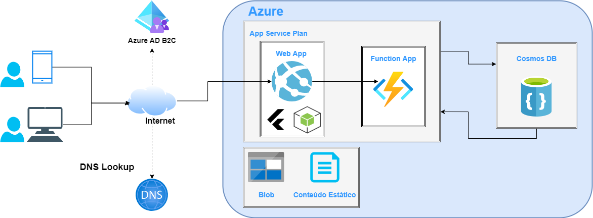
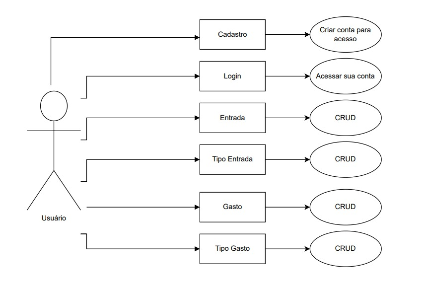
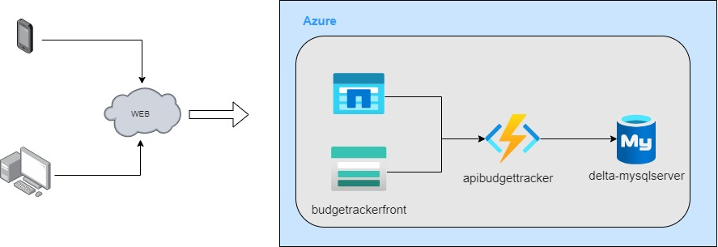
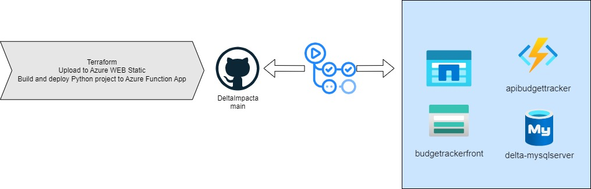
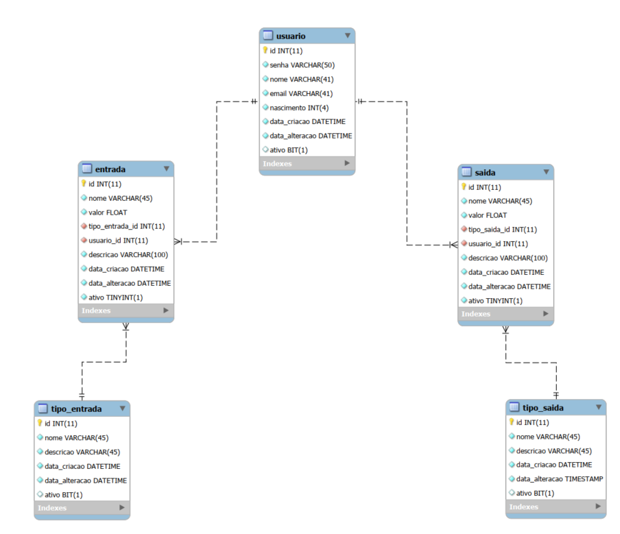

# Projeto Budget Tracker - Delta Team

## Web App Voltado para o gerenciamento de gastos.

*O inicio de tudo...*

Durante uma conversa sobre o projeto que poderiamos desenvolver como trabalho final, foi uma decissão unânime de que seria uma boa ter um sistema que nos ajudasse a ter uma visão melhor de nossos gastos! 

## Planejamento inicial

Em nossas primeiras Weeklys realizamos o desenho inicial da infraestrutura o esboço das atividades a serem executadas e por fim a organização do nosso banco de Dados.

## Requisitos iniciais

*Módulo de Usuário*

		US => Implemente uma página de cadastro de usuário.
				Como, Usuário do sistema 
				quero criar a minha conta
				Para obter acesso ao sistema.
				
				Critérios de aceite:
				A página de criação de usuário deve ser acessada através um link na página ???institucional?? ou 
				através de um link na página de login do sistema.
				Deve ser possível informar um e-mail, nome completo e data de nascimento.
				****O sistema deve enviar um e-mail de confirmação ao e-mail informado antes de haver a liberação do acesso*****
				O sistema deve validar o formato do e-mail, a quantidade de caracteres mínima do nome e a validação contra uma lista
				de termos proibidos.
				O sistema deve validar se o e-mail informado já existe na base de dados
				A página deve seguir o padrão de identidade visual.
				As confirmações devem ser feitas usando o template de modal com as opções Enviar, Cancelar e Sair.

		US => Implemente uma visão dos dados do usuário.
				Como, Usuário do sistema 
				quero visualizar e editar meus dados
				Para manter meu cadastro sempre atualizado.
				
				Critérios de aceite:
				A funcionalidade de usuário deve ser acessada através de um clique no nome do usuário exibido no topo da página,
				lado esquerdo.
				Deve ser possível visualizar todos os dados informados na criação de usuário, a seguir:  
				nome completo
				e-mail
				nascimento
				data da criação da conta
				Deve ser possível editar todos os dados exceto o e-mail e a data da criação da conta.
				Deve ser possível alterar a senha.
				A página deve seguir o padrão de identidade visual.
				A página deve seguir o template para visualização de dados.
				As confirmações devem ser feitas usando o template de modal com as opções Editar, Cancelar e Sair.

		US => Criação de página de Login
				Como, Usuário do sistema 
				quero me autenticar no sistema
				Para obter acesso à area logada.
				
				Para acessar o sistema é obrigatório a autenticação via usuário e senha;
				Deverá ser validar a formatação do e-mail, quando não for inserido o @ ou pontuação, deve ser exibido a mensagem [E-mail inválido! Verifique o e-mail inserido];
				Caso o usuário tente acessar uma página sem estar logado ele deve ser direcionado para página de login;
				Ao acessar tentar se autenticar deve ser validado:
				Se o usuário existe na base;
				Se o usuário está ativo;
				Se a senha não esta correta;
				Se a senha é válida;

				Se o usuário existe na base
				Caso o e-mail informado seja inválido deve ser exibido a mensagem [Usuário não cadastrado! Entre em contato com o administrador do sistema].
				Se o usuário está ativo
				Caso o usuário esteja inativo deve ser exibido a mensagem [Ocorreu um erro de acesso! Entre em contato com o administrador do sistema].
				Se a senha não esta correta
				Caso o usuário digite uma senha incorreta deve ser exibido a seguinte mensagem ["Senha incorreta! Tente novamente"] .

				Se a senha é válida
				Caso a senha sela válida o usuário deve ser direcionado para home do sistema e o menu deve ser exibido conforme seus acessos. 

				A página deve seguir o padrão de identidade visual.
				As confirmações devem ser feitas usando o template de modal com as opções Enviar, Cancelar e Sair.

		US => Criação de página de recuperação de senha
				Como, Usuário do sistema 
				quero poder recuperar minha senha
				Para obter acesso ao sistema.
				
				Critérios de aceite:
				Na tela de login deverá disponibilizar um link para recuperação de senha;
				Ao clicar na opção "Esqueci minha senha?" deverá exibido um modal para que seja inserido o e-mail de sua conta;
				Deve ser validado
				Validar a formatação do e-mail;
				Se o e-mail inserido está cadastrado;

				Validar a formatação do e-mail
				Deverá ser validar a formatação do e-mail, quando não for inserido o @ ou pontuação, deve ser exibido a mensagem [E-mail inválido! Verifique o e-mail inserido];

				Se o e-mail inserido está cadastrado
				Caso o e-mail informado seja inválido deve ser exibido a mensagem [Usuário não cadastrado! Entre em contato com o administrador do sistema].
				Caso o e-mail inserido possua cadastro, deverá ser enviado com o link de recuperação para o e-mail inserido;
				Deve ser exibido uma mensagem após a requisição de envio de e-mail [Enviamos um link para o seu e-mail "<e-mail>". Acesse seu e-mail e clique neste link para redefinir sua senha]
				Ao acessar o link de recuperação de senha recebido no e-mail preenchido, deve ser direcionado para uma tela de cadastramento de uma nova senha;
				O cadastro da nova senha dever seguir os seguintes critérios:
				Possuir no mínimo 8 caracteres
				Ter no mínimo 1 caractere especial
				Possuir no mínimo 1 letra
				Possuir ao menos um número
				Não ser igual a três últimas cadastradas
				Caso a nova senha inserida não obedeça alguns dos critérios deverá ser exibido o critério que a senha não esta atendendo;
				Após o preenchimento da nova senha e clicar em continuar, deve ser exibido uma mensagem de confirmação [Sua senha foi alterada com sucesso]
				Após a exibição da mensagem de confirmação, o usuário deve ser direcionado para página de login;
				Todas as mensagens devem ser exibidas utilizando o template de modal para as mensagens.
				A página deve seguir o padrão de identidade visual.
				As confirmações devem ser feitas usando o template de modal com as opções Enviar, Cancelar e Sair.
				

*Módulo de Serviços*

		US => Implemente uma visão das despesas do usuário.
				Como, Usuário do sistema 
				quero gerir a todas as despesas
				Para criar os ensumos para a geração dos relatórios.
				
				Critérios de aceite:
				A funcionalidade de usuário deve ser acessada através de um clique no menu Entradas.
				Deve ser possível visualizar uma lista com todas as despesas cadastradas.
				na área de filtro/pesquisa de despesas  deve conter as seguintes ações: "Pesquisar", "Limpar pesquisa" 
				e "Cadastrar";	
				Deve ser possível pesquisar clicando no botão de pesquisa ou clicando no "ENTER" do teclado;
				Ao acionar "Limpar pesquisa" deve ser limpado o filtro de busca;
				Ao realizar a pesquisa, caso não tenha nenhum resultado, deve ser retornado a mensagem 
				[Nenhum resultado encontrado];

				FILTRAR
					Deve ser ser possível pesquisar por: 
					ID,
					Entrada
					Tipo de Entrada
					Data da criação
					A lista deve ser ordenada sempre do cadastro mais recente para o mais antigo;
					
				PAGINAR
					Deve exibir o número das páginas de acordo com retorno de pesquisa realizada;
					Como default deve ser retornado 10 resultados por página;

				ITENS POR PÁGINA
					Deve ser apresentado um combo "Itens por página" com os seguintes ranges de resultados: 10, 15, 20, 25 e 30;
					Quando o usuário alterar a quantidade de itens por página, deve ser reexibido a visualização considerando a quantidade selecionada;

				CADASTRAR
					Ao clicar no botão de cadastro deve ser exibido um modal com os seguintes campos:
					Entrada *(nome da entrada)*
					Descrição 
					Tipo de entrada
						combo box com os tipos de entrada. Salário, Doação, Prêmio, Rendimentos, Outros
					
					No modal, deve ter as seguintes ações: "Salvar", "Cancelar" e "Fechar";
					Caso o usuário acione a opção "Cancelar", deve ser fechado do modal;
					Caso o usuário acione a opção "Fechar", deve ser fechado do modal;
					Caso o usuário acione a opção "Salvar" sem o preenchimento algum campo obrigatório, deve ser sinalizado o campo 
					em vermelho com a mensagem [<campo> é de preenchimento obrigatório];
					Caso o usuário acione a opção "Salvar" e todos os campos obrigatórios estejam preenchidos, deve ser realizado 
					chamada na API para alterar os dados;
					Deve ser implementado os tratamentos dos retornos "ERROR"/NOK da API;
					A API deve validar se os dados não estão duplicados, caso estejam, deve retornar a mensagem [Cadastro duplicado];
					O campo ID não deve ser alterado;
					Caso o retorno da API seja de sucesso, deve ser exibido a mensagem [Alterações efetuadas  com sucesso];
					
				EDITAR
					A opção 'editar cadastro' deve ser apresentada na GRID linha de cadastro do usuário;
					Ao ser acionado o botão "Editar" deve ser exibido um modal com dados cadastrados;
					No modal, deve ter as seguintes ações: "Salvar", "Cancelar" e "Fechar";
					Caso o usuário acione a opção "Cancelar", deve ser fechado do modal;
					Caso o usuário acione a opção "Fechar", deve ser fechado do modal;
					Caso o usuário acione a opção "Salvar" sem o preenchimento algum campo obrigatório, deve ser sinalizado o campo em vermelho com a mensagem [<campo> é de preenchimento obrigatório];
					Caso o usuário acione a opção "Salvar" e todos os campos obrigatórios estejam preenchidos, deve ser realizado chamada na API para alterar os dados;
					Deve ser implementado os tratamentos dos retornos "ERROR"/NOK da API;
					A API deve validar se os dados não estão duplicados, caso estejam, deve retornar a mensagem [Cadastro duplicado];
					O campo ID não deve ser alterado;
					Caso o retorno da API seja de sucesso, deve ser exibido a mensagem [Alterações efetuadas  com sucesso];
					
				EXCLUIR
					A opção excluir cadastro deve ser apresentada na GRID linha de cadastro do usuário;
					Ao ser acionado o botão "Excluir" deve ser exibido um modal de confirmação com a mensagem 
					[Tem certeza que deseja realizar a exclusão do cadastro?];
					O modal deve conter as seguintes ações: "Excluir", "Cancelar" e "Fechar";
					Caso o usuário acione a opção "Cancelar", deve ser fechado do modal;
					Caso o usuário acione a opção "Fechar", deve ser fechado do modal;
					Caso o usuário acione a opção "Excluir", deve ser excluído o cadastro do serviço da base;

				A página deve seguir o template para Listagem de dados.
				
		US => Implemente uma visão das receitas do usuário.
				Como, Usuário do sistema 
				quero gerir todas as receitas
				Para criar os ensumos para a geração dos relatórios.
				
				Critérios de aceite:
				A funcionalidade de usuário deve ser acessada através de um clique no menu Receitas.
				Deve ser possível visualizar uma lista com todas as receitas cadastradas.
				na área de filtro/pesquisa de receitas  deve conter as seguintes ações: "Pesquisar", "Limpar pesquisa" 
				e "Cadastrar";	
				Deve ser possível pesquisar clicando no botão de pesquisa ou clicando no "ENTER" do teclado;
				Ao acionar "Limpar pesquisa" deve ser limpado o filtro de busca;
				Ao realizar a pesquisa, caso não tenha nenhum resultado, deve ser retornado a mensagem 
				[Nenhum resultado encontrado];

				FILTRAR
					Deve ser ser possível pesquisar por: 
					ID,
					Receitas
					Tipo de Receitas
					Data da criação
					A lista deve ser ordenada sempre do cadastro mais recente para o mais antigo;
					
				PAGINAR
					Deve exibir o número das páginas de acordo com retorno de pesquisa realizada;
					Como default deve ser retornado 10 resultados por página;

				ITENS POR PÁGINA
					Deve ser apresentado um combo "Itens por página" com os seguintes ranges de resultados: 10, 15, 20, 25 e 30;
					Quando o usuário alterar a quantidade de itens por página, deve ser reexibido a visualização considerando a quantidade selecionada;

				CADASTRAR
					Ao clicar no botão de cadastro deve ser exibido um modal com os seguintes campos:
					Receitas *(nome da receitas)*
					Descrição 
					Tipo de receitas
						combo box com os tipos de receitas. Salário, Doação, Prêmio, Rendimentos, Outros
					
					No modal, deve ter as seguintes ações: "Salvar", "Cancelar" e "Fechar";
					Caso o usuário acione a opção "Cancelar", deve ser fechado do modal;
					Caso o usuário acione a opção "Fechar", deve ser fechado do modal;
					Caso o usuário acione a opção "Salvar" sem o preenchimento algum campo obrigatório, deve ser sinalizado o campo 
					em vermelho com a mensagem [<campo> é de preenchimento obrigatório];
					Caso o usuário acione a opção "Salvar" e todos os campos obrigatórios estejam preenchidos, deve ser realizado 
					chamada na API para alterar os dados;
					Deve ser implementado os tratamentos dos retornos "ERROR"/NOK da API;
					A API deve validar se os dados não estão duplicados, caso estejam, deve retornar a mensagem [Cadastro duplicado];
					O campo ID não deve ser alterado;
					Caso o retorno da API seja de sucesso, deve ser exibido a mensagem [Alterações efetuadas  com sucesso];
					
				EDITAR
					A opção 'editar cadastro' deve ser apresentada na GRID linha de cadastro do usuário;
					Ao ser acionado o botão "Editar" deve ser exibido um modal com dados cadastrados;
					No modal, deve ter as seguintes ações: "Salvar", "Cancelar" e "Fechar";
					Caso o usuário acione a opção "Cancelar", deve ser fechado do modal;
					Caso o usuário acione a opção "Fechar", deve ser fechado do modal;
					Caso o usuário acione a opção "Salvar" sem o preenchimento algum campo obrigatório, deve ser sinalizado o campo em vermelho com a mensagem [<campo> é de preenchimento obrigatório];
					Caso o usuário acione a opção "Salvar" e todos os campos obrigatórios estejam preenchidos, deve ser realizado chamada na API para alterar os dados;
					Deve ser implementado os tratamentos dos retornos "ERROR"/NOK da API;
					A API deve validar se os dados não estão duplicados, caso estejam, deve retornar a mensagem [Cadastro duplicado];
					O campo ID não deve ser alterado;
					Caso o retorno da API seja de sucesso, deve ser exibido a mensagem [Alterações efetuadas  com sucesso];
					
				EXCLUIR
					A opção excluir cadastro deve ser apresentada na GRID linha de cadastro do usuário;
					Ao ser acionado o botão "Excluir" deve ser exibido um modal de confirmação com a mensagem 
					[Tem certeza que deseja realizar a exclusão do cadastro?];
					O modal deve conter as seguintes ações: "Excluir", "Cancelar" e "Fechar";
					Caso o usuário acione a opção "Cancelar", deve ser fechado do modal;
					Caso o usuário acione a opção "Fechar", deve ser fechado do modal;
					Caso o usuário acione a opção "Excluir", deve ser excluído o cadastro do serviço da base;

				A página deve seguir o template para Listagem de dados.

				receitas => recebidos
				despesas => pagos

*Dashboards*

			US => 
			como, Usuário do sistema
			quero poder visualizar gráficos relacionados a despesas e receitas
			para ter uma fácil identificação dos meus resultados
			
			Deve ser possível visualizar 4 tipos de gráficos, sendo
			tipos de receita por periodo Pízza,
			tipo de entrada por periodo Pízza,
			top 10 gastos periodo barras e
			perdas e ganhos linha
			
			caso o usuário ainda não tenha cadastrado as despesas e/ou receitas, a área do respectivo gráfico não deve 
			ser apresentada.
			os gráficos deverão receber como input as informações cadastradas pelo usuário nas funcionalidades de inclusão 
			de despesa e receita. 
			deve ser possível selecionar o período de visualização dos dados sendo o intervalo máximo 12 meses.
			ao selecionar novo período os gráficos devem ser atualizados automaticamente com as novas informações.
			A página deve seguir o template para visualização de dados.	

__Bom nem todos os requisitos foram entregues mas seguimos em frente!__

# Diagrama de Uso

Bom como todo bom Software também temos nossos diagramas de uso conforme visto abaixo.

# Infraetrutura Final

Com a evolução dos requisitos e a evolução do nosso ambiente tivemos algumas mudanças na estrutura Final do projeto tendo arquitetura.

## Integrações

Para facilitar nossos deploys e termos um controle das mudanças integramos o nosso Repositório com a Azure para criação da infraestrutura via Terraform, Deploy do FrontEnd dentro do webstatic pages e Deploy do FrontEnd dentro do Azure Functions.

Seguindo o modelo Trunk Based todas as mudanças mergeadas na branch Main seguem por um sequência de automações que gerenciam seus respectivos ambientes.
Detalhando as automações:

### Workflows

> Build and deploy Python project to Azure Function App - apibudgettracker

Automação para o Deploy de nosso BackEnd dentro do Azure Functions. Pode ser executado manualmente é disparado em toda pull request destinada a branch main.

> Upload To Azure WEB Static

Automação para o Deploy de nossas páginas estáticas dentro da Azure Blob

> Terraform

Provisionamento da nossa infraestrutura dentro da Azure, criação de recursos são executadas atráves dessa integração.

## Estrutura do Banco de Dados 

Abaixo temos o diagrama da estrutura final das nossas tabelas do banco relacional MySQL

## Visão final 

Com essas soluções e requisitos citados chegamos ao resultado final de toda a nossa [aplicação.](https://budgetrackerfront.z19.web.core.windows.net/)

Nossa [documentação](https://apibudgettracker.azurewebsites.net/docs) detalhada de todas as chamadas possíveis do nosso backend.

